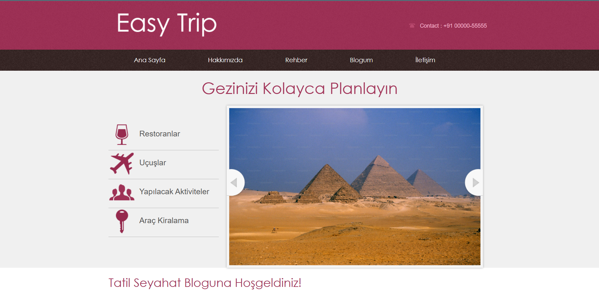
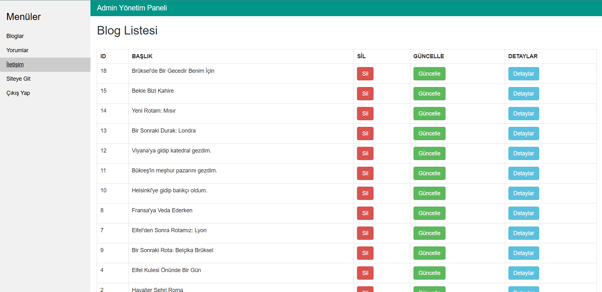
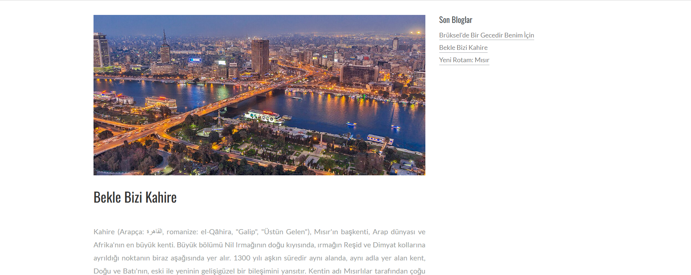
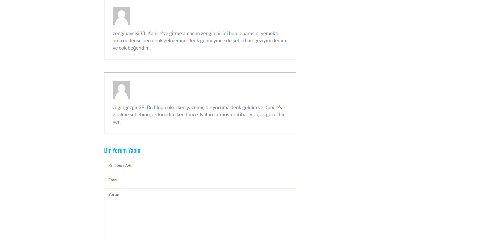

# TravelTripCoreProject

ASP.NET Core MVC kullanılarak geliştirilmiş, blog ve seyahat temalı bir içerik yönetim sistemidir.

## 🚀 Kullanılan Teknolojiler

- ASP.NET Core MVC
- Entity Framework Core
- Microsoft SQL Server
- Layered Architecture

## 📦 Proje Özellikleri

- Admin panelinden blog ekleme, silme, güncelleme
- Kullanıcılar yorum bırakabilir (Ad, Soyad, Mail ile)
- Katmanlı mimari ile yapılandırılmıştır

## 📸 Ekran Görüntüleri

## ⚙️ Kurulum

1. `dotnet ef database update`
2. `dotnet run` veya Visual Studio ile çalıştır

